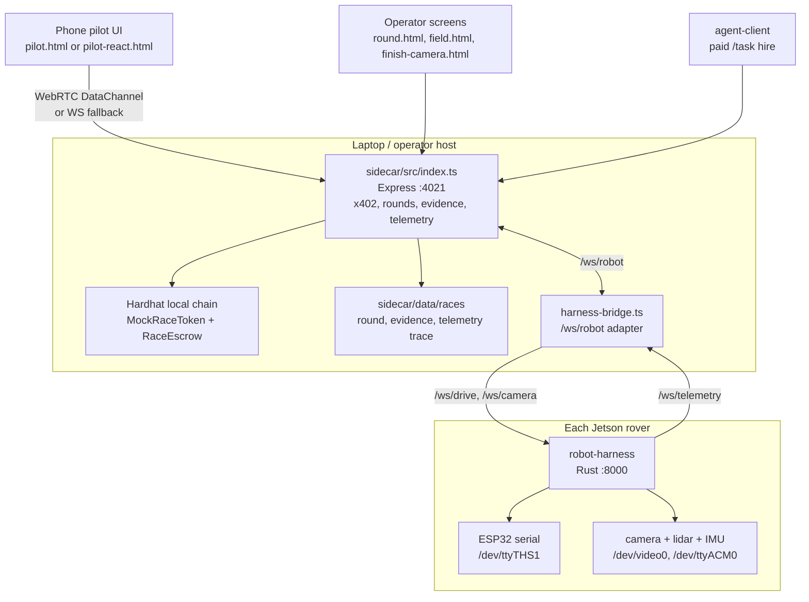
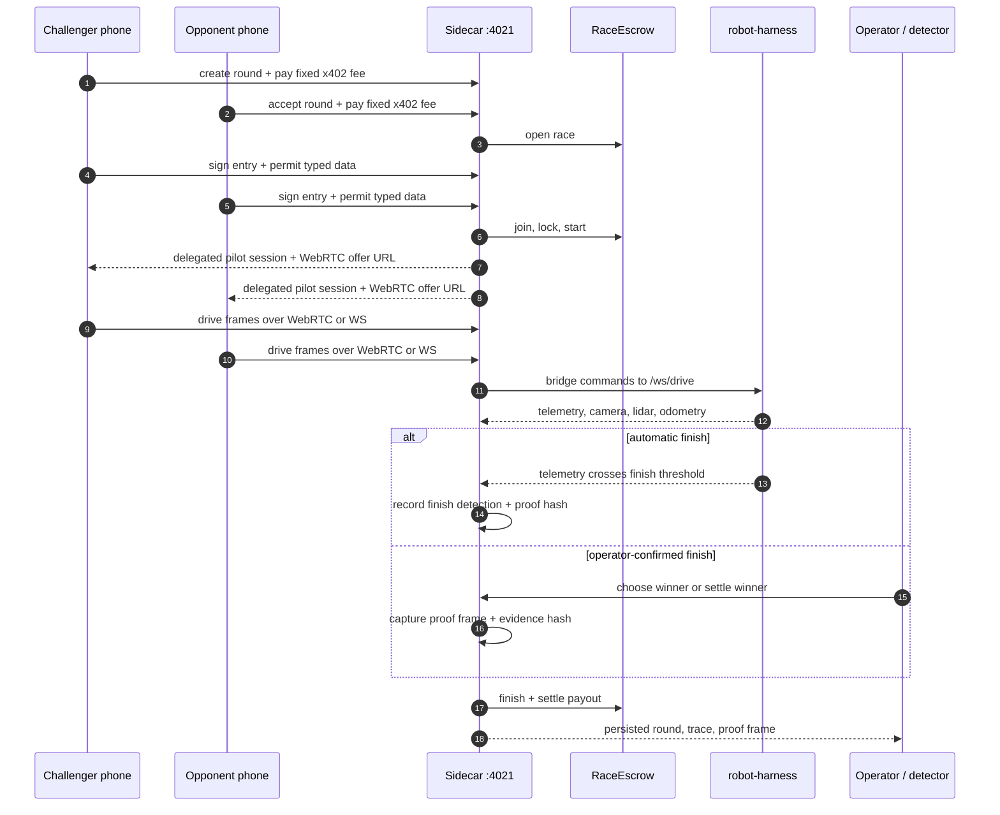

# Clanker500 — ETHGlobal NYC 2026

### Give your AI agent a body.

Every agent at this hackathon is trapped behind a screen. We gave two of them
bodies: a fleet of **Waveshare UGV rovers (Jetson Orin NX)** that you **hire over
HTTP**, that earn an **on-chain reputation**, and whose **treasury only a human
can unlock with a Ledger**. Identity, payments, reputation, a labor market, and
human governance — every sponsor doing real work, with a robot on the table the
whole time.

```
   hire (x402/Arc) → robot acts → Gemini verifies → proof on Walrus
         ▲                                                │
    BigQuery rank ◄── ERC-8004 reputation ◄── requester rates the job
```

## The two acts
- **Act 1 - The Checkpoint:** a courier robot is hired, drives to the guard
  robot, they greet in speech then **switch to GibberLink** (data-over-sound);
  the guard verifies it **on-chain** (signed challenge + AgentBook human-backing +
  ERC-8004 + EventPass) -> rejects it -> the robots run a **Texas-auctioneer Dutch
  auction** to negotiate the pass price -> pay + mint on Arc -> admitted -> proof to
  Walrus -> reputation ticks up.
- **Act 2 - Clanker500 GP:** spectators **pay to pilot** the rovers through x402
  sessions. The current control path is sidecar-mediated: the browser gets a
  delegated pilot token, sends drive over WebRTC DataChannel by default with a
  WebSocket fallback, and the Rust `robot-harness` enforces speed caps, deadman,
  estop, telemetry, camera, and lidar contracts on each Jetson.
- **Climax:** withdrawing the fleet's earnings **blocks** until a human
  clear-signs on a **Ledger** (ERC-7730: "Withdraw N USDC → recipient").

## Current race runtime

The fielded race path is centered on the Node sidecar and Rust rover harness.
The older Python autonomy stack still exists for Act 1 checkpoint work; it is
documented separately in **[ROBOTICS.md](ROBOTICS.md)** because it cannot own the
same serial and camera devices at the same time as `robot-harness`.



### Clanker500 GP race flow



## What's real
The sponsor integrations are real code paths. The repo also has explicit local
simulators and dev-wallet gates for rehearsing without hardware or public funds:
- **Identity** — robots sign challenges with their own EOA keys (verified by
  recovery); **live AgentBook reads** on World Chain for human-backing.
- **World ID** — real IDKit proof → World cloud verifier → real nullifier; every
  bet requires it (no proof = no bet).
- **ENS** — real on-chain registration on Sepolia (`roverfleet.eth` + guard/
  courier subnames + ENSIP-25 `agent-registration` records), resolved live via viem.
- **Payments / settlement** — real USDC transfers, EventPass mint, RaceMarket
  bets + settle on **Arc** (USDC-as-gas), via viem.
- **Reputation** — ERC-8004-compatible `ReputationRegistry` on Arc, requester
  rates the agent, feeds the leaderboard.
- **Proof** — finish/job photos stored on **Walrus** (real blobId, read-back
  verified), hash anchored on-chain.
- **Governance** — `Treasury` withdrawable only by the Ledger-held owner,
  clear-signed via an ERC-7730 descriptor. (Owner transferred to a real Ledger
  device; gas-funded so the device-signed withdrawal broadcasts.)
- **Decentralized verification (Chainlink CRE)** — a DON independently calls the
  robot's `GET /attest`, reaches **median consensus** on the verification score,
  and `writeReport`s the verdict to `AttestationConsumer` on Sepolia. The robot's
  self-claim never settles — `isVerified(job)` gates the mint/payment/reputation.
- **Custody (Privy)** — robot signing keys live in Privy's TEE, not on the host;
  `settle.pay()` signs through the enclave (`CUSTODY=privy`). **LIVE**: real Arc
  tx signed in the TEE (`0x6a9b8fdd…`).
- **Network reputation (BigQuery)** — ranks every on-chain agent by ERC-8004
  `NewFeedback` volume on the canonical mainnet registry (partition-pruned,
  dry-run guarded); the rover's local Arc reputation shown alongside.

## Deployed & live (verified on-chain)
| Thing | Address / id | Chain |
|---|---|---|
| EventPass | `0xb4fd7be40fb501433f403f8ecf46084075af4d77` | Arc 5042002 |
| ReputationRegistry | `0x876bdebd935696982a906ea51609b518d6902b68` | Arc |
| Treasury (Ledger-owned) | `0xfd15f8ffc6d82df92b77ded9a2b3535e23a86f43` | Arc |
| AttestationConsumer (CRE) | `0x0fdb04628c8821d2cd7ebd5cc2d23e1a46a077e3` | Sepolia |
| World ID app / RP | `app_2c9c29e4…` / `rp_8fe1202b…` (action `rover-gp-bet`) | World 4.0 (on-chain) |
| Privy wallets (TEE) | guard `0x4C726E70…` · courier `0x76f7c993…` | Arc |

Verified live: real USDC settlements on Arc (incl. **TEE-signed via Privy**),
EventPass minted, ERC-8004 feedback, a Treasury withdrawal gated by a **physical
Ledger** (owner transferred to the device + gas-funded), Walrus proofs read back
& hash-matched, and `GET /attest` serving a verified score for the CRE DON.

Things that still need a credential/login to *execute* (no mock fallback):
**`cre login`** + `simulate --broadcast` (writes the DON verdict — consumer is
already deployed and `/attest` serves 85/100), and **GCP creds** for the BigQuery
leaderboard. Everything else above is live.

## Layout
- `robot-harness/` - Rust service for each Jetson. It owns `/dev/ttyTHS1`,
  camera/lidar hooks, pilot tokens, deadman, speed caps, estop, and
  `/ws/drive`/`/ws/camera`/`/ws/telemetry`. Deployment and recovery live in
  `robot-harness/deploy/`.
- `sidecar/` - Node 22 + TS (:4021). x402 paid routes, local race rounds,
  sidecar-owned pilot sessions, WebRTC/WS control bridge, telemetry traces,
  local chain routes, field preflight, evidence packets, and operator settlement.
  `harness-bridge.ts` adapts each Rust rover to the sidecar `/ws/robot` socket.
- `sidecar/public/` — **`wall.html`** the FLEET COMMAND master wall (cinematic
  big-screen view: cognition stream, on-chain ledger, holo dials, Walrus proof,
  CRE oracle), `round.html`/`lobby.html` for the operator race board,
  `field.html` for preflight, `finish-camera.html`, `pilot.html`,
  `pilot-react.html`, `show-links.html`, `race.html`, and `ledger.html`.
- `chain/` - Hardhat local-chain project for `MockRaceToken` and `RaceEscrow`;
  deployment exports `sidecar/src/generated/contracts.local.json`.
- `robot/` - Python Act 1/autonomy stack. It still contains the FastAPI robot
  API, serial wrapper, NoMaD/RoboBrain/RoboOS integration, GibberLink, speech,
  proof, and checkpoint code, but it is an alternate hardware owner to the Rust
  harness.
- `contracts/` — `EventPass.sol`, `ReputationRegistry.sol`, `RaceMarket.sol`,
  `Treasury.sol`, `AttestationConsumer.sol`, `erc7730/treasury.json`.
- `cre-workflow/` — Chainlink CRE workflow (`main.ts` + `config.json` + `SETUP.md`).
- `docs/LOCAL_CHAIN_RACE_HARNESS.md` - local chain, Compose, phone flow,
  robot-link, evidence, sensor replay, and field simulator runbook.
- `docs/HARDWARE_BRINGUP.md` - cold-boot rover readiness runbook.
  `docs/JETSON_BRIDGE.md` - robot/sidecar boundary.
- `ROBOTICS.md` — autonomy stack (NoMaD nav foundation model, RoboBrain brain, RoboOS multi-agent).

## Run
```bash
# local chain + sidecar in containers
npm install
npm run compose:up
npm run compose:logs
```

```bash
# manual local sidecar development
npm --prefix chain install
npm --prefix sidecar install
npm run chain:node
npm run chain:deploy
cd sidecar
npm run build:pilot
ALLOW_FREE_PILOT=1 ALLOW_LOCAL_DEV_WALLETS=1 npm start
```

```bash
# no-hardware verification against the Rust simulator
SIDECAR_URL=http://127.0.0.1:4021 npm --prefix sidecar run e2e:harness-bridge
SIDECAR_URL=http://127.0.0.1:4021 npm --prefix sidecar run e2e:field-sim
```

```bash
# Jetson recovery/deploy, then laptop deploy check
./robot-harness/deploy/reset-good-state.sh \
  --role guard \
  --sidecar-url http://<laptop-ip>:4021 \
  --profile wifi \
  --drive-invert

npm run robot:deploy-check -- \
  --bot guard=http://<guard-ip>:8000 \
  --bot courier=http://<courier-ip>:8000 \
  --sidecar-url http://<laptop-ip>:4021
```

```bash
# deep integrations once their creds/funds are in .env
cd sidecar
npx tsx src/register-ens.ts
npx tsx src/go-live.ts
npx tsx src/deploy-consumer.ts
npx tsx src/privy-provision.ts
npx tsx src/ledger-handover.ts 0x<dev>
# CRE: see cre-workflow/SETUP.md
```

Demo at `http://<laptop>:4021/wall.html` (the big-screen FLEET COMMAND wall) ·
`/round.html` (operator race board) · `/field.html` (preflight) ·
`/pilot.html` or `/pilot-react.html` (driver) · `/finish-camera.html` ·
`/ledger.html`.
