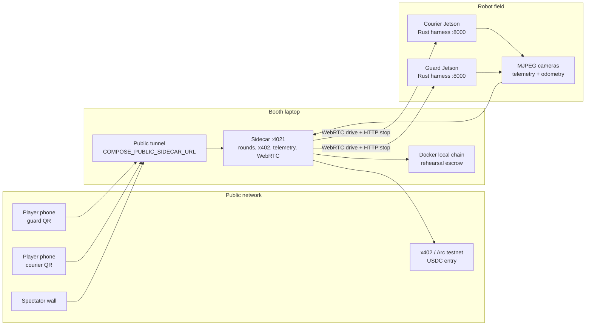
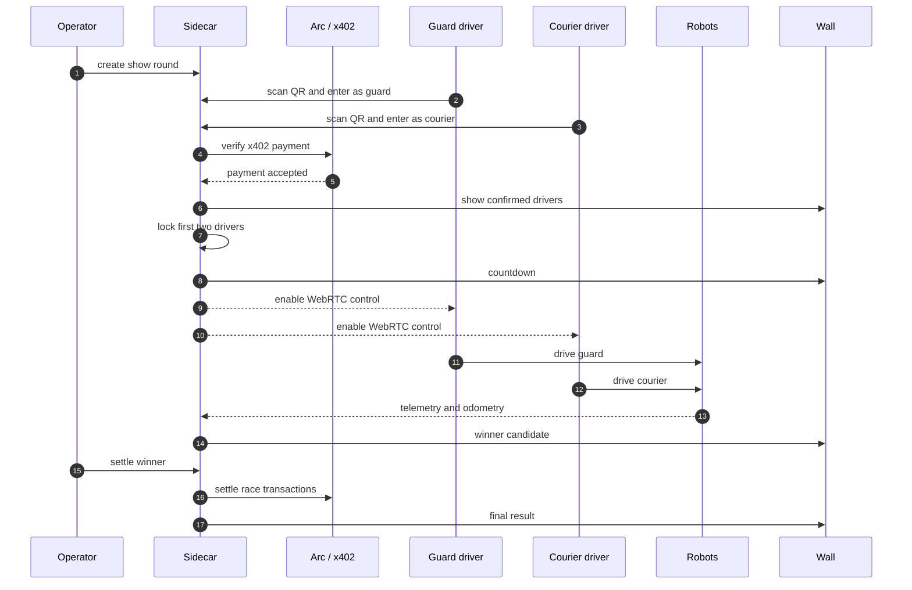
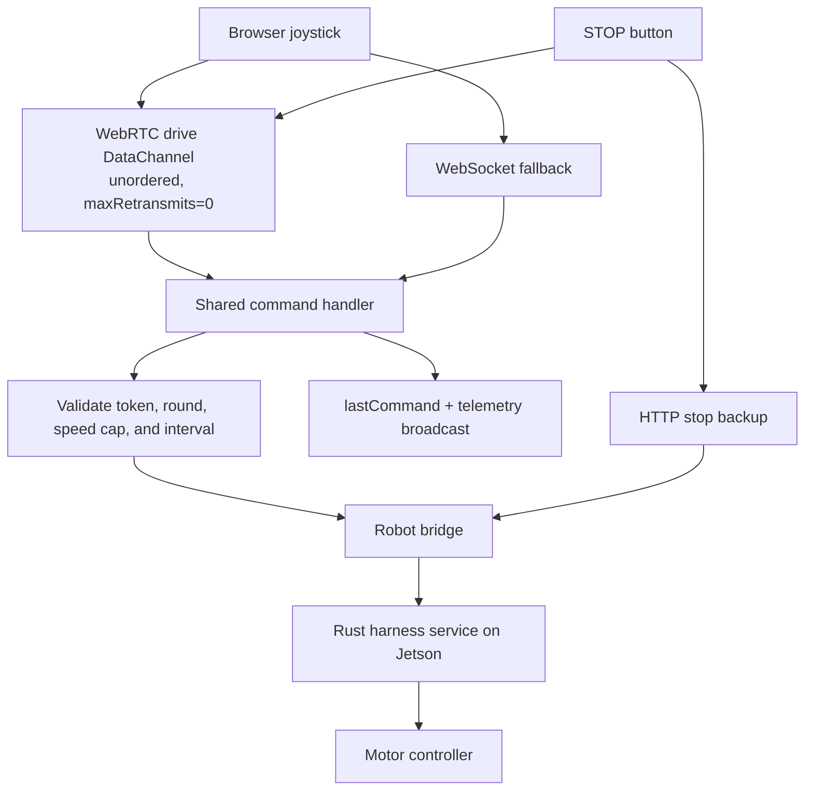
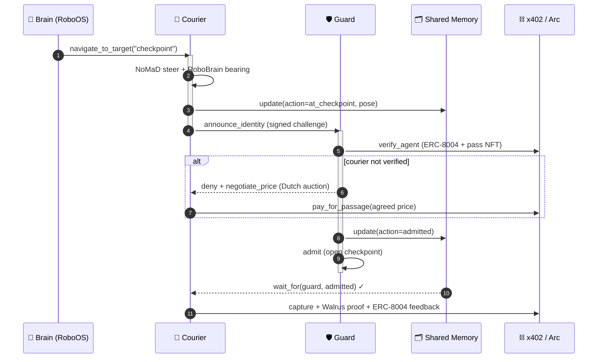

# 🏁 The Clanker 500 — ETHGlobal NYC 2026
### Two robots. Real USDC on the line. Every lap settled on-chain.

*(formerly "The Onchain Rover")*

Every other agent at this hackathon is stuck in the pits — behind a screen. We put two
of them on the track: a fleet of **Waveshare UGV rovers (Jetson Orin NX)** that you
**hire over HTTP**, that earn an **on-chain reputation**, and whose **winnings only a
human can unlock with a Ledger**. Identity, payments, reputation, a labor market, and
human governance — every sponsor doing real work, with a robot on the table the whole
time.

**Sponsors, at a glance:** ENS + ERC-8004 (identity & reputation) · x402 + Circle/Arc
(USDC wages & gas) · World ID (sybil-proof betting) · Walrus (proof storage) ·
Chainlink CRE (decentralized verification) · Privy (TEE custody) · Ledger (clear-signed
treasury) · Gemini (vision verification) · BigQuery (network leaderboard) · Dynamic +
Blink (instant wallets & on-ramp).

**Jump to:** [What's real (not mocked)](#whats-real-not-mocked) ·
[Deployed addresses](#deployed--live-verified-on-chain) ·
[Show runbook](#show-runbook) ·
[Run with no hardware](#no-robot-no-gpu-run-the-whole-loop-anyway)

### Links & meta
- 🎥 **Demo video (3 min):** _TODO: paste link before submitting_
- 🏁 **Live dashboard (no setup):** **https://0xsoftboi.github.io/onchain-rover/** — the
  full **Clanker 500** wall, running standalone in your browser (mock data baked in).
- 🌐 **Local dashboards (with sidecar on :4021):** `mux.html` (the unified Clanker 500
  wall) · `wall.html` (cinematic big-screen) · `index.html` (Mission Control)
- 📜 **License:** _TODO: add a LICENSE file (MIT recommended)_
- 👥 **Team:** _TODO: names / ETHGlobal handles_
- 🔍 **Start here:** `sidecar/settle.ts` (all on-chain writes) · `contracts/` (deployed
  contracts) · `robot/agent.py` (autonomy loop) · [Deployed addresses](#deployed--live-verified-on-chain)

```
   hire (x402/Arc) → robot acts → Gemini verifies → proof on Walrus
         ▲                                                │
    BigQuery rank ◄── ERC-8004 reputation ◄── requester rates the job
```

## The two acts
- **Qualifying — The Checkpoint:** a courier robot is hired, drives to the guard
  robot, they greet in speech then **switch to GibberLink** (data-over-sound);
  the guard verifies it **on-chain** (signed challenge + AgentBook human-backing +
  ERC-8004 + EventPass) → rejects it → the robots run a **Texas-auctioneer Dutch
  auction** to negotiate the pass price → pay + mint on Arc → admitted → proof to
  Walrus → reputation ticks up.
- **Race day — The Clanker 500:** spectators **pay to pilot** the rovers ($1 x402
  sessions, WebRTC joystick with WebSocket fallback + deadman) and **bet USDC** on a
  fruit-obstacle drag race (parimutuel, **one bet per human via real World ID**),
  settled on-chain by the guard robot's Walrus-anchored finish photo.
- **Parc Fermé (the climax):** withdrawing the fleet's earnings **blocks** until a
  human clear-signs on a **Ledger** (ERC-7730: "Withdraw N USDC → recipient").

## Show runbook

For a live booth run, keep the sidecar on the laptop and expose only the sidecar's
public URL. The QR links point players at round entry; the operator keeps a separate
settlement control page and never has to expose raw robot URLs.

```bash
cp .env.compose.example .env.compose
docker compose --env-file .env.compose up --detach --wait
```

Set `COMPOSE_PUBLIC_SIDECAR_URL` to the tunnel URL before printing QR codes. Keep
`COMPOSE_ALLOW_FREE_PILOT=0` for public play, use `COMPOSE_ALLOW_ROUND_PILOT=1` for
paid round control, and set `COMPOSE_ALLOW_SHOW_RACE_AUTOSTART=1` when the first two
confirmed players should trigger the countdown automatically. The local fallback flag
`COMPOSE_ALLOW_SHOW_X402_FALLBACK=1` is for rehearsals only; leave it off when Arc
testnet settlement is the source of truth.

Key booth URLs:
- Operator wall: `<public-sidecar-url>/round.html`
- Guard entry: `<public-sidecar-url>/round.html?robot=guard&entry=x402`
- Courier entry: `<public-sidecar-url>/round.html?robot=courier&entry=x402`
- Manual pilot: `<public-sidecar-url>/pilot-react.html?robot=guard&mode=manual&transport=webrtc&speed=high`
- Preflight: `<public-sidecar-url>/field.html`

### Live show topology



### Race lifecycle



### Control and safety path



## Autonomy stack

Act 1 isn't a scripted handshake — it runs a state-of-the-art embodied-AI pipeline:
a **navigation foundation model** (NoMaD/ViNT) for control, an **embodied-reasoning
VLM** (RoboBrain 2.0) for semantic goals, and a **hierarchical multi-agent OS**
(RoboOS) for Guard⇄Courier coordination. Heavy models run off-board on a laptop GPU
(LeRobot async pattern); the Jetson runs only the real-time loop. Full write-up in
**[ROBOTICS.md](ROBOTICS.md)**.


### Act 1 — "The Checkpoint" end-to-end



## What's real (not mocked)
Every integration is real code — on-chain reads/writes or real signatures, no
fake data (`grep` the repo: no `Math.random` nullifiers, no stubs):
- **Identity** — robots sign challenges with their own EOA keys (verified by
  recovery); **live AgentBook reads** on World Chain for human-backing.
- **World ID** — real IDKit proof → World cloud verifier → real nullifier; every
  bet requires it (no proof = no bet).
- **ENS** — real on-chain registration on Sepolia (`roverfleet.eth` + guard/
  courier subnames + ENSIP-25 `agent-registration` records), resolved live via viem.
- **Payments / settlement** — real USDC transfers, EventPass mint, RaceMarket
  bets + settle on **Arc** (USDC-as-gas), via viem.
- **Reputation** — ERC-8004-compatible `ReputationRegistry` on Arc, requester
  rates the agent, feeds the leaderboard.
- **Proof** — finish/job photos stored on **Walrus** (real blobId, read-back
  verified), hash anchored on-chain.
- **Governance** — `Treasury` withdrawable only by the Ledger-held owner,
  clear-signed via an ERC-7730 descriptor. (Owner transferred to a real Ledger
  device; gas-funded so the device-signed withdrawal broadcasts.)
- **Decentralized verification (Chainlink CRE)** — a DON independently calls the
  robot's `GET /attest`, reaches **median consensus** on the verification score,
  and `writeReport`s the verdict to `AttestationConsumer` on Sepolia. The robot's
  self-claim never settles — `isVerified(job)` gates the mint/payment/reputation.
- **Custody (Privy)** — robot signing keys live in Privy's TEE, not on the host;
  `settle.pay()` signs through the enclave (`CUSTODY=privy`). **LIVE**: real Arc
  tx signed in the TEE (`0x6a9b8fdd…`).
- **Network reputation (BigQuery)** — ranks every on-chain agent by ERC-8004
  `NewFeedback` volume on the canonical mainnet registry (partition-pruned,
  dry-run guarded); the rover's local Arc reputation shown alongside.

## Deployed & live (verified on-chain)
| Thing | Address / id | Chain |
|---|---|---|
| EventPass | `0xb4fd7be40fb501433f403f8ecf46084075af4d77` | Arc 5042002 |
| ReputationRegistry | `0x876bdebd935696982a906ea51609b518d6902b68` | Arc |
| Treasury (Ledger-owned) | `0xfd15f8ffc6d82df92b77ded9a2b3535e23a86f43` | Arc |
| AttestationConsumer (CRE) | `0x0fdb04628c8821d2cd7ebd5cc2d23e1a46a077e3` | Sepolia |
| World ID app / RP | `app_2c9c29e4…` / `rp_8fe1202b…` (action `rover-gp-bet`) | World 4.0 (on-chain) |
| Privy wallets (TEE) | guard `0x4C726E70…` · courier `0x76f7c993…` | Arc |

Verified live: real USDC settlements on Arc (incl. **TEE-signed via Privy**),
EventPass minted, ERC-8004 feedback, a Treasury withdrawal gated by a **physical
Ledger** (owner transferred to the device + gas-funded), Walrus proofs read back
& hash-matched, and `GET /attest` serving a verified score for the CRE DON.

### On the two credential-gated pieces (no mock fallback — by design)
- **Chainlink CRE:** the `AttestationConsumer` is **already deployed on Sepolia**
  (`0x0fdb04628c8821d2cd7ebd5cc2d23e1a46a077e3`) and the robot's `GET /attest` is
  **already serving a live 85/100 score**. The only step needing `cre login` is the
  DON's final `simulate --broadcast` — a judge-side auth, not missing code. Workflow
  is committed in `cre-workflow/`.
- **BigQuery:** the partition-pruned, dry-run-guarded query is committed in
  `sidecar/bigquery.ts`; it needs GCP creds in `.env` to hit the public ERC-8004
  dataset. Runs live at the booth in ~30s.

We deliberately ship **no mock fallback** for these two, so there's zero ambiguity
about what's real vs. simulated. Everything else above is live.

## Layout
- `robot/` — Python on each Jetson. `api.py` (FastAPI :8000 + MJPEG `/stream` +
  pilot WS + heartbeat), `rover.py` (serial bridge), `agent.py` (LLM task loop),
  `camera.py` (shared capture), `perception.py` (Gemini seek + AprilTag),
  `negotiate.py` (Dutch auction), `finish_line.py` (race judge), `gibber.py`
  (GibberLink), `voice.py` (espeak), `proof.py` (Walrus), `checkpoint.py` (Act 1).
  `GET /attest` = the verifiable work score the Chainlink DON consumes.
- `sidecar/` — Node 22 + TS (:4021). x402 Gateway paid surface, `identity.ts`
  (signed challenge + AgentBook), `worldid.ts` (real verify, World ID 4.0 RP),
  `settle.ts` (Arc pay/mint/reputation/race/treasury, custody router), `privy.ts`
  (TEE-signed accounts), `cre.ts` (reads the DON verdict), `bigquery.ts` (network
  reputation), `ens.ts`. Scripts: `deploy-{eventpass,reputation,treasury,consumer}.ts`,
  `ledger-handover.ts`, `privy-provision.ts`, `register-ens.ts`, `go-live.ts`.
- `sidecar/public/` — **`wall.html`** the FLEET COMMAND master wall (cinematic
  big-screen view: cognition stream, on-chain ledger, holo dials, Walrus proof,
  CRE oracle), `index.html` mission control, `broadcast.html`, `race.html`
  (betting), `pilot.html` (joystick), `ledger.html` (clear-sign treasury).
- `contracts/` — `EventPass.sol`, `ReputationRegistry.sol`, `RaceMarket.sol`,
  `Treasury.sol`, `AttestationConsumer.sol`, `erc7730/treasury.json`.
- `cre-workflow/` — Chainlink CRE workflow (`main.ts` + `config.json` + `SETUP.md`).
- `DEMO_RUNBOOK.md` — the timed 3-minute script.
  `docs/HARDWARE_BRINGUP.md` — cold-boot rover readiness runbook.
  `docs/JETSON_BRIDGE.md` — bridge spec.
- `ROBOTICS.md` — autonomy stack (NoMaD nav foundation model, RoboBrain brain, RoboOS multi-agent).

## Run
```bash
# each Jetson (stop the stock app first):
pgrep -f '[a]pp.py' | xargs -r kill
ROBOT_ROLE=guard SIDECAR_URL=http://<laptop-ip>:4021 \
  ~/ugv_jetson/ugv-env/bin/python -m uvicorn api:app --host 0.0.0.0 --port 8000

# laptop:
cd sidecar && npm i && npm run build:ledger
node --import tsx src/preflight.ts      # readiness board
node --import tsx src/index.ts          # sidecar + dashboards on :4021

# once funded (Circle booth / faucets):
npx tsx src/register-ens.ts             # real ENS on Sepolia
npx tsx src/go-live.ts                  # deploy contracts + run the full on-chain loop
```

### The dashboard — the Clanker 500 wall
One unified "wall of mini terminals" shows the whole stack at once — onboard cams,
on-device Gemma3 reasoning, the live **RACE CONTROL** event bus, pending→confirmed
settlements (with gas/block/latency), parimutuel odds, World ID betting, reputation,
the photo-finish proof on Walrus, and the Ledger-governed winner's purse — laid out as
the three-act arc (Qualifying → The Main Event → Chequered Flag).

- **Published, zero-setup:** **https://0xsoftboi.github.io/onchain-rover/** runs fully
  standalone — `site/clanker-mock.js` patches `fetch` + `EventSource` so every tile
  animates with no backend. Source lives in [`site/`](site/); deployed on the
  `gh-pages` branch.
- **Attach a live rig:** append `?api=<sidecar-url>` (e.g. an ngrok tunnel) to stream
  **real** data, with automatic fall-back to mock per-call if the backend is down.
  Requires the current sidecar build (the bus lives at `GET /events/stream`) — CORS is
  enabled for read-only viewers.
- **Local (with sidecar on :4021):** open `mux.html`. `DEMO_MOCK=1 npm start` fills
  every panel server-side for hardware-free review.

### No robot? No GPU? Run the whole loop anyway
Every off-board service has a `stub` backend, so a judge can validate the full
pipeline on a laptop with zero hardware:
```bash
POLICY_BACKEND=stub BRAIN_BACKEND=stub ./scripts/demo_up.sh   # dry run, no installs
python robot/test_stack.py                                    # control math, odometry, handshake, settlement plumbing
```

```bash
# deep integrations (once their creds/funds are in .env):
npx tsx src/deploy-consumer.ts          # AttestationConsumer → Sepolia (CRE)
npx tsx src/privy-provision.ts          # Privy TEE wallets; set CUSTODY=privy
npx tsx src/ledger-handover.ts 0x<dev>  # treasury owner → your Ledger + gas
# CRE: see cre-workflow/SETUP.md (cre login + simulate --broadcast)
```

Demo at `http://<laptop>:4021/wall.html` (the big-screen FLEET COMMAND wall) ·
`/` (mission control) · `/race.html` · `/pilot.html` · `/ledger.html`.
