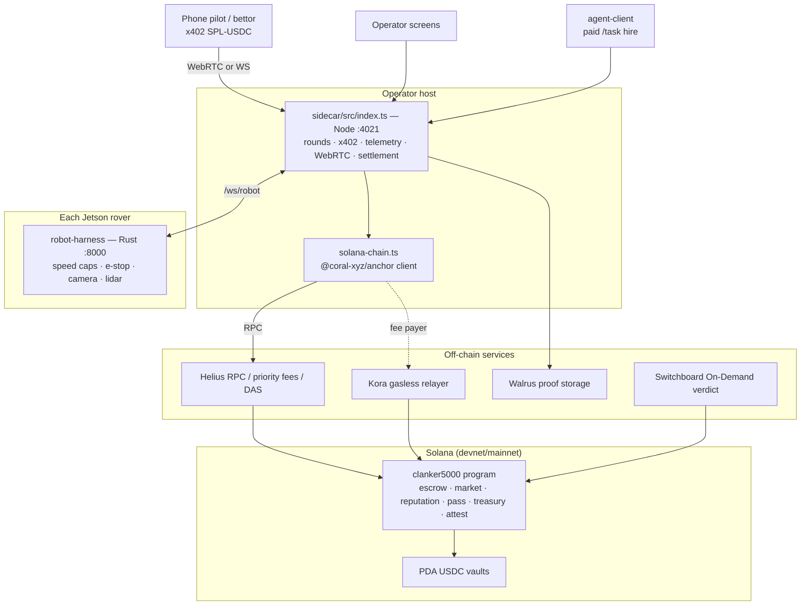

# 🏁 Clanker 5000 — a robot race & labor market, settled natively on Solana

### Two physical rovers. Real USDC on the line. Every lap settled by one Anchor program.

*Native-Solana rebuild of The Clanker 500 / "Onchain Rover." **All EVM code is
removed** — one Solana program is the sole settlement backend. The EVM/Arc demo
lives in a separate repo.*

> **Status — verified end-to-end:**
> `anchor build` ✅ (BPF + IDL, **Anchor 0.31 / Agave 4.0.3**) ·
> `anchor test` ✅ **3/3** on a local validator (race payout 2× · parimutuel
> bet→settle→claim · World-ID nullifier reject) ·
> sidecar `tsc --noEmit` ✅ 0 errors · `sidecar/src` is **100% EVM-free**.
> Decision record: [`docs/SOLANA_NATIVE_MIGRATION.md`](docs/SOLANA_NATIVE_MIGRATION.md) ·
> RPC/fees/DAS: [`docs/HELIUS.md`](docs/HELIUS.md) ·
> deploy: [`docs/DEPLOY_SOLANA.md`](docs/DEPLOY_SOLANA.md).

Every other agent at a hackathon is stuck behind a screen. We put two on the
track: a fleet of **Waveshare UGV rovers (Jetson Orin NX)** you **hire over
HTTP**, that earn an **on-chain reputation**, race for **USDC stakes**, and whose
**winnings only a human can unlock with a Ledger**. Identity, payments,
reputation, a betting market, and human governance — all native Solana, with a
robot on the table the whole time.

---

## The stack

| Capability | Native-Solana tech | Where |
|---|---|---|
| **Settlement** (escrow, market, reputation, passes, treasury, attestation) | **one Anchor program — `clanker5000`** | `solana/programs/clanker5000` |
| **Money** | **SPL-USDC** (6dp), held in per-race/market **PDA vaults**; payouts via token CPI | program + `sidecar/src/solana-chain.ts` |
| **Paid routes** | **x402** `exact` scheme over SPL-USDC (hire a robot / pilot / join a race) | `sidecar/src/solana-x402.ts` |
| **Gasless** | **Kora** relayer (fee payer; users pay fees in USDC) — replaces EIP-3009 | `sidecar/src/solana-gasless.ts` |
| **RPC + priority fees + assets** | **Helius** (free tier): keyed backend RPC, `getPriorityFeeEstimate`, DAS | `sidecar/src/helius.ts`, `solana-config.ts` |
| **Identity / naming** | **SNS** `.sol` — `guard/courier.roverfleet.sol` + agent-context record | `sidecar/src/sns.ts` |
| **Reputation** | on-program ERC-8004-style registry (`register_agent`/`give_feedback`, running avg) | program + `sidecar/src/leaderboard.ts` |
| **Sybil-proof betting** | **World ID** (off-chain verify) + on-chain **nullifier PDA** (one human, one bet) | `worldid.ts` + `place_bet` |
| **Verification oracle** | **Switchboard On-Demand** writes the finish verdict via the program's `forwarder` | `write_attestation` + `cre.ts` |
| **Proof storage** | **Walrus** (chain-agnostic); the verdict/photo hash is anchored on-chain | `evidence.ts` + `proof_hash` fields |
| **Custody** | **Privy** Solana server wallets (TEE signing, `chain_type:"solana"`) | `privy.ts`, `wallets.ts` |
| **Treasury governance** | PDA USDC vault, owner-gated; owner = **Ledger Solana** / **Squads v4** clear-sign | `withdraw_treasury` + `treasury-ledger.ts` |
| **Robots** | **Jetson Orin NX** rovers, **Rust harness** (speed caps, e-stop, telemetry, camera/lidar) | `robot-harness/` |
| **Off-chain server** | **Node 22 + TS** sidecar (:4021): rounds, x402, WebRTC pilot bridge, settlement | `sidecar/` |

**Toolchain:** Anchor **0.31.0**, Agave (Solana CLI) **4.0.3** / platform-tools
v1.53, `@coral-xyz/anchor` (TS) ^0.31.1, SPL-Token (classic) for USDC,
`@solana/web3.js` v1.

---

## The on-chain program (`clanker5000`)

One Anchor program replaces what used to be six Solidity contracts. 24
instructions, grouped:

- **Race escrow** — `initialize` · `open_race` · `join_race` · `lock_race` ·
  `start_race` · `finish_race` · `settle_race` (winner gets 2× stake) ·
  `cancel_race` (refund) · `set_facilitator`. Stakes live in a per-race PDA token
  vault (`[b"vault", race]`); the driver signs `join_race` directly (no relayed
  EIP-712/permit — that EVM dance collapses on Solana).
- **Parimutuel market** — `open_market` · `place_bet` · `settle_market` ·
  `claim` · `set_judge`. Payout = `stake × total_pool / winning_pool` (u128
  math). **One-human-one-bet** is structural: a `nullifier` PDA seeded by the
  World ID nullifier `init`s once; a reused nullifier collides and fails.
- **Reputation (ERC-8004 port)** — `register_agent` · `give_feedback`
  (per-agent + per-feedback PDAs, running count/sum, `NewFeedback` event,
  self-feedback rejected).
- **EventPass** — `init_event_pass` · `mint_pass` (PDA per id, minter-gated,
  price recorded; `holds(who)` via `getProgramAccounts`).
- **Treasury** — `init_treasury` · `withdraw_treasury` (owner-gated, the Ledger/
  Squads governance boundary) · `set_treasury_owner` (PDA USDC vault).
- **Attestation (oracle verdict)** — `init_attestation` · `set_forwarder` ·
  `write_attestation` (per-job PDA, threshold 70, forwarder-gated). The robot's
  own claim never settles anything — downstream reads `verified`.

`settle_race` / `settle_market` attach **Helius-priced ComputeBudget
instructions** so payouts land under congestion.

---

## The show (three acts)

- **Qualifying — the checkpoint.** A courier rover is hired (x402, SPL-USDC),
  drives to the guard rover, they greet in speech then switch to **GibberLink**
  (data-over-sound). The guard verifies it on-chain (signed challenge + SNS
  identity + reputation + EventPass), runs a Dutch auction for the pass price,
  pays + mints on Solana, and anchors the proof to Walrus.
- **Race day — Clanker 5000.** Spectators **pay to pilot** the rovers ($1 x402
  sessions, WebRTC joystick + deadman). The Rust harness enforces speed caps,
  e-stop, and telemetry while drivers **bet USDC** on a fruit-obstacle drag race
  (parimutuel, **one bet per human via World ID**), settled on-chain from the
  guard's Walrus-anchored finish photo, verdict landed by a Switchboard DON.
- **Parc fermé — the climax.** Withdrawing the fleet's earnings **blocks** until
  a human clear-signs on a **Ledger** (the treasury owner): "Withdraw N USDC →
  recipient."

---

## Architecture



---

## Repo layout

- **`solana/`** — the `clanker5000` Anchor program (`programs/clanker5000/src/lib.rs`),
  `tests/clanker5000.ts` (integration suite), `Anchor.toml`, IDL/types.
- **`sidecar/`** — Node 22 + TS (:4021). x402 paid routes, race rounds, WebRTC/WS
  pilot bridge, telemetry, evidence, operator settlement. Solana client +
  integrations: `solana-chain.ts`, `solana-config.ts`, `solana-x402.ts`,
  `solana-gasless.ts` (Kora), `helius.ts`, `sns.ts`, `settle.ts`, `privy.ts`,
  `worldid.ts`. Generated IDL at `sidecar/src/generated/clanker5000.json`.
- **`robot-harness/`** — Rust service per Jetson: serial/motor control, camera/
  lidar, pilot tokens, deadman, speed caps, e-stop, `/ws/drive|camera|telemetry`.
- **`robot/`** — Python Act-1 autonomy stack (FastAPI, GibberLink, speech, nav).
  See [`ROBOTICS.md`](ROBOTICS.md). (Alternate hardware owner to the Rust harness.)
- **`docs/`** — [`SOLANA_NATIVE_MIGRATION.md`](docs/SOLANA_NATIVE_MIGRATION.md)
  (per-component decision record), [`HELIUS.md`](docs/HELIUS.md),
  [`DEPLOY_SOLANA.md`](docs/DEPLOY_SOLANA.md), [`SOLANA_PORT.md`](docs/SOLANA_PORT.md).

> Gone with the EVM cutover: `contracts/` (Solidity), `chain/` (Hardhat),
> `cre-workflow/` (Chainlink CRE), and all viem/ENS/Arc code.

---

## Build, test, deploy

```bash
# toolchain (see docs/DEPLOY_SOLANA.md for the version pins that matter)
sh -c "$(curl -sSfL https://release.anza.xyz/v4.0.3/install)"
npm i -g @coral-xyz/anchor-cli@0.31.0

cd solana
anchor build                 # BPF + IDL + types
cp target/idl/clanker5000.json ../sidecar/src/generated/clanker5000.json
anchor test                  # local validator → 3/3
```

Deploy to a cluster (RPC throughput matters — use a keyed Helius/QuickNode URL;
free public RPCs rate-limit the ~640-write upload):

```bash
solana program deploy target/deploy/clanker5000.so \
  --program-id target/deploy/clanker5000-keypair.json \
  --url "$RPC" --use-rpc --max-sign-attempts 5000
```

> **Program ID:** `4FLTsBUD6iCQo5VBzdCSv8imoCnhttnQ1GQFEHL5iEDD` (declared).
> Devnet deployment in progress; address confirmed here once finalized.

### Run the sidecar

```bash
cd sidecar && npm install
# .env: CHAIN_BACKEND=solana, HELIUS_API_KEY=…, SOLANA_PROGRAM_ID, SOLANA_USDC_MINT,
#       FACILITATOR_SECRET_KEY, TREASURY_ADDRESS  (see ../.env.example)
npm start
```

The Solana backend needs the deploy artifacts: `anchor build` IDL copied into
`sidecar/src/generated/clanker5000.json`, plus a deployed program id + USDC mint
+ facilitator key in `contracts.solana.json` / env. `HELIUS_API_KEY` is used
server-side only — the key is never exposed to phone/frontend clients.

---

## Status of the external integrations

| Integration | State |
|---|---|
| Program (escrow/market/reputation/pass/treasury/attest) | ✅ built + `anchor test` 3/3 |
| Sidecar client, x402 gate, SNS resolve, reputation, Helius | ✅ implemented, `tsc` clean |
| Kora gasless · SNS registration · Privy-Solana · Switchboard forwarder · Squads owner | 🟡 code/scaffold landed — need accounts/keys to go live |
| Devnet deployment | 🟡 in progress (RPC throughput) |

See [`docs/SOLANA_NATIVE_MIGRATION.md`](docs/SOLANA_NATIVE_MIGRATION.md) for the
sourced per-integration recommendations and the remaining cutover steps.
