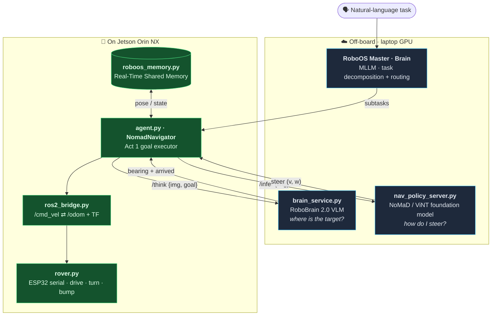
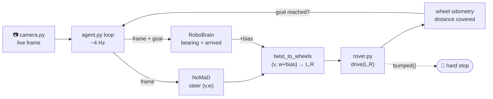
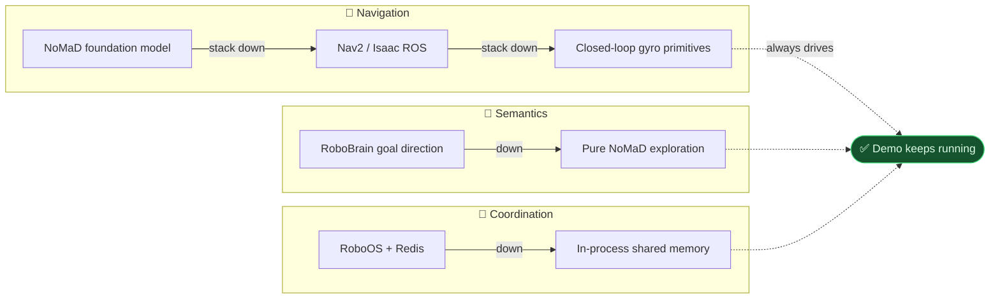
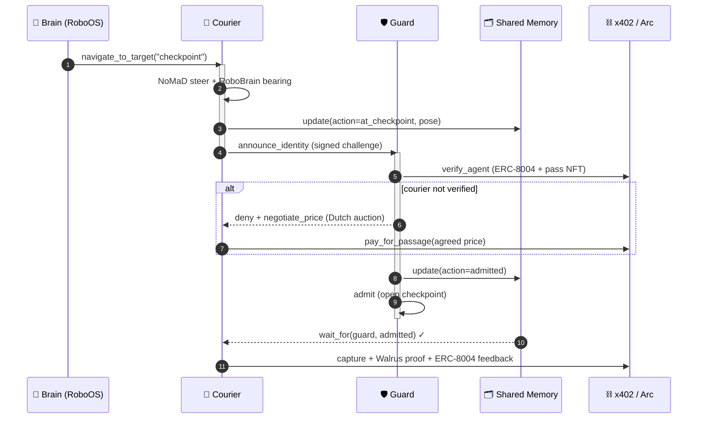

# The Onchain Rover — Robotics Stack

This documents the **autonomy stack** behind the rovers, independent of the crypto
rails. The headline: Act 1 ("The Checkpoint") runs a genuinely state-of-the-art
embodied-AI pipeline — a **navigation foundation model**, an **embodied-reasoning
VLM**, and a **hierarchical multi-agent OS** — on two Waveshare UGVs (Jetson Orin
NX, ESP32 motor control, stereo/USB camera).

> **Why not "just drop in a VLA"?** Almost every flagship VLA (GR00T, Pi0, SmolVLA,
> OpenVLA, G0Tiny) is trained for **manipulation/humanoid arms** — they output
> end-effector actions, not steering, and don't run a differential-drive base.
> The UGV-correct SOTA is a **navigation foundation model** (NoMaD/ViNT) for control
> plus an **embodied-reasoning VLM** (RoboBrain) for semantic goals. That's what this
> stack does.

---

## Architecture

Heavy models run **off-board on a laptop GPU** (LeRobot async pattern); the Jetson
runs only the real-time control loop. Each box is one file in `robot/`.



### The control loop (one `agent.py` iteration, ~4 Hz)



### Design principle — graceful degradation

Each layer falls back to the next if its stack isn't up, so **a single failure
never kills the live demo**. Everything is gated behind `autonomous=True`, so
Act 2 (Rover GP, human-piloted) and the generic `/task` hire flow are untouched.



---

## Components

### 1. Navigation foundation model — `nav_policy_server.py` + `nomad_client.py`
Off-board policy server runs **NoMaD / ViNT / GNM** via the
[`general-navigation`](https://github.com/AdityaNG/general-navigation) package,
wrapping its `GPTVision.step()` stepper exactly (diffusion policy, internal temporal
context). Each frame the policy emits an 8-waypoint trajectory; we steer off the
first non-trivial waypoint (`x` lateral, `y` forward) through `waypoint_to_twist()`
→ a unicycle `(v, w)`. The Jetson runs only the dumb fast half (grab → POST →
relay), keeping the NX free for capture + control — the **LeRobot async
PolicyServer/RobotClient** pattern.

- Backends: `nomad` (real model) | `stub` (creep-forward, validates the whole loop
  with no model + no robot).
- Relay: ROS2 `/cmd_vel` (via `ros2_bridge.py`) or HTTP to api.py `/drive`.
- *Note:* the packaged NoMaD runs goal-**masked** exploration (obstacle-aware
  forward nav following a learned prior); the goal **direction** comes from RoboBrain.

> **Gotcha (verified against real `nomad.pth` weights).** `general-navigation` also
> exposes `controls.steer`, but it comes from a **car bicycle-model MPC** (2.84 m
> wheelbase) that needs a non-zero *vehicle speed* — at a small rover's `velocity=0`
> it collapses to exactly `0`, so steering off `controls.steer` makes the rover drive
> dead-straight. We steer off the **trajectory waypoint** instead, which is valid at
> any speed and matches a differential base. `NAV_LAT_SIGN` flips the lateral axis if
> a build mirrors it; `NAV_STEER_SIGN` flips turn direction. (Fix: commit `061bd28`.)

### 2. ROS2 bridge — `ros2_bridge.py`
Makes the rover a first-class ROS2 node so Nav2 / Isaac ROS (cuVSLAM + Nvblox) can
drive it: subscribes `/cmd_vel` (Twist) → wheels, publishes `/odom` + `odom→base_link`
TF from wheel encoders (`OdomIntegrator`, differential-drive dead-reckoning). Reuses
the existing serial owner (api.py) so there's no port contention. Pure helpers are
unit-tested without rclpy or hardware.

### 3. Embodied-reasoning brain — `brain_service.py`
**RoboBrain 2.0-3B** (BAAI, Apache-2.0, edge-optimized) via `transformers`,
reproducing the repo's exact **pointing-task** prompt + point regex. Given the frame
and a natural-language target, it returns a 2D point (rel 0–1000) → converted to a
steering **bearing** and an **arrived** flag — the goal-direction and stop signal
that goal-masked NoMaD lacks. Optional and additive: unset/unreachable → pure NoMaD.

### 4. Act 1 goal executor — `agent.py::NomadNavigator`
Priority chain `make_navigator()`: **NoMaD → Nav2 → primitive**. A metric
`goto(forward, left)` is honored as a hybrid — closed-loop gyro turn to the bearing,
then NoMaD steers while wheel odometry covers the distance; RoboBrain biases the
steering toward the target and ends the goto on `arrived`. `bumped()` is a hard
collision stop throughout.

### 5. Multi-agent layer — `roboos_profile.py` + `roboos_memory.py`
**RoboOS** (FlagOpen, Apache-2.0) Brain-Cerebellum hierarchy. `roboos_profile.py` is
the Cerebellum **skill library** for a **wheeled** embodiment (RoboOS chassis class),
each skill wrapping our live api.py + sidecar endpoints; skills are **role-tagged**
(EMOS "robot resume" style) so the Brain assigns Guard vs Courier emergently.
`roboos_memory.py` is the **Real-Time Shared Memory** (Redis, in-process fallback):
both rovers publish pose/state; `wait_for()` is the Guard⇄Courier handshake. The
crypto settlement rides on top of real embodied coordination.

---

## Act 1 end-to-end — "The Checkpoint"

The Brain decomposes one task across two robots; they coordinate through shared
memory, and the on-chain settlement is layered on top of a genuine embodied
interaction (not a scripted handshake).



---

## Running it

All off-board services have a `stub`/fallback backend, so you can exercise the
**entire loop with no GPU, no models, and no robot** first, then swap real weights in.

```bash
# ── laptop (GPU) ──────────────────────────────────────────────────────────
POLICY_BACKEND=nomad     uvicorn nav_policy_server:app --host 0.0.0.0 --port 4041
BRAIN_BACKEND=robobrain  uvicorn brain_service:app     --host 0.0.0.0 --port 4051
# multi-agent (optional): RoboOS stand-alone branch
redis-server & python master/run.py &

# ── Jetson Orin NX (api.py stopped so agent owns serial+camera) ───────────
ROVER_NAV=nomad \
NAV_SERVER=http://<laptop>:4041 \
BRAIN_SERVER=http://<laptop>:4051 BRAIN_GOAL="the checkpoint" \
  ./ugv-env/bin/python agent.py --autonomous "go to the checkpoint and photograph it"
```

Validate the plumbing first with `POLICY_BACKEND=stub` / `BRAIN_BACKEND=stub`.
If the rover turns the wrong way on the first real run, flip `NAV_STEER_SIGN=-1`.

### Key environment variables
| Var | Default | Purpose |
|---|---|---|
| `ROVER_NAV` | `auto` | Pin navigator: `nomad`/`nav2`/`primitive`/`auto` |
| `NAV_SERVER` | `localhost:4041` | NoMaD policy server URL |
| `BRAIN_SERVER` | _(unset)_ | RoboBrain server URL (enables semantic goal-seeking) |
| `BRAIN_GOAL` | `the checkpoint` | NL target the brain points at |
| `NAV_STEER_SIGN` | `1.0` | Flip to `-1` if turn direction is mirrored |
| `NAV_LAT_SIGN` | `1.0` | Flip to `-1` if the trajectory's lateral axis is mirrored |
| `ROVER_ODOM_SCALE` | `0.0001` | Metres per encoder tick (calibrate on a 1 m drive) |
| `REDIS_URL` | `localhost:6379` | RoboOS shared memory |

---

## Demo operations (Phase 5)

Tooling to run the stack reliably on stage — one-command bringup, a preflight
board, auto-recovery, and tests.

**Preflight — `robot/demo_doctor.py`.** Green/red checklist of every moving part
(both rovers' `/health` + battery + serial/IMU, sidecar, Ollama, NoMaD + RoboBrain
servers, robot registry). Never crashes; exits non-zero if any *critical* piece is
down. Optional pieces (brain, 2nd rover) are warnings.
```bash
python robot/demo_doctor.py            # one-shot, exit 0 = ready
python robot/demo_doctor.py --watch    # live board, refreshes every 3s
```

**One-command bringup + auto-recovery.**
```bash
# laptop — supervised servers that RESTART on crash (stub-capable, no installs)
POLICY_BACKEND=nomad BRAIN_BACKEND=robobrain ./scripts/demo_up.sh
./scripts/demo_down.sh                  # stop all

# each rover — stops the stock app, launches api.py wired to the laptop
ROLE=guard   LAPTOP=<laptop-ip> ./scripts/jetson_up.sh
ROLE=courier LAPTOP=<laptop-ip> ./scripts/jetson_up.sh
```
`demo_up.sh` runs each server under a supervisor loop (restart with backoff). On a
CUDA Linux box, `deploy/docker-compose.yml` does the same with
`restart: unless-stopped` + healthchecks. **Resilience is layered:** servers
auto-restart; the client/`NomadNavigator` retry per-frame and fall back
(NoMaD→Nav2→primitive, brain→pure-NoMaD) on any failure.

**Tests — `robot/tests/test_stack.py`.** `pytest robot/tests` covers the control
math, odometry, shared-memory handshake, role-tagged skills, the stub servers
end-to-end (FastAPI `TestClient`), and the navigator fallback chain. Tests
`importorskip` heavy deps, so the pure-logic set runs anywhere and the rest run in
the server venv / on the Jetson.

---

## References (verified, 2025–2026)
- **NoMaD / ViNT / GNM** — navigation foundation models: <https://github.com/AdityaNG/general-navigation>
- **RoboBrain 2.0** — embodied-reasoning VLM (3B edge): <https://github.com/FlagOpen/RoboBrain2.0> · <https://huggingface.co/BAAI/RoboBrain2.0-3B> · [arXiv 2505.03673]
- **RoboOS** — Brain-Cerebellum multi-agent OS: <https://github.com/FlagOpen/RoboOS> · [arXiv 2505.03673]
- **LeRobot** async PolicyServer/RobotClient: <https://github.com/huggingface/lerobot> · <https://huggingface.co/docs/lerobot/async>
- **Isaac ROS** (cuVSLAM + Nvblox + Nav2, lidar-free, Orin NX): <https://docs.nav2.org/tutorials/docs/using_isaac_perceptor.html>
- **COMPASS** cross-embodiment mobility policy: <https://github.com/NVlabs/COMPASS>

> Caveats worth stating to judges: edge-FPS for VLAs is benchmarked on AGX/Orin
> *Nano*, not Orin NX — measure on-device before quoting numbers. Isaac Sim training
> tools (COMPASS, MobilityGen) are workstation-only. NoMaD's car-trained MPC is
> scale-free in steer, which is why it transfers to a small differential base.
